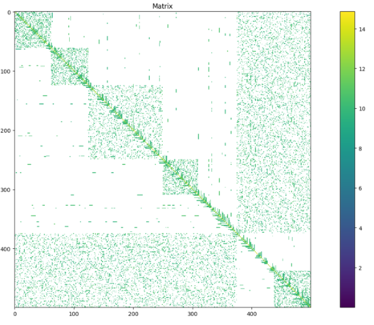
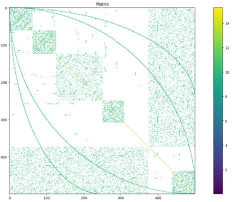
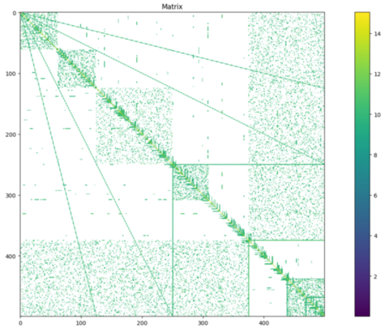

PyConjugateGradients
====================

Implementation of Conjugate Gradient method for solving systems of linear equation using Python.
This project was part of `ConjugateGradients`__ though it was
split into separate repo.

__ https://github.com/stovorov/ConjugateGradients

Road-map:

::

    - [X] Create test matrices generator
    - [X] Implement pure CG
    - [ ] Implement PCG
            - [X] Jacobi preconditioner
            - [ ] SSOR preconditioner
            - [ ] Incomplete Cholesky factorization preconditioner

Getting started
---------------

::

    $ git clone https://github.com/stovorov/ConjugateGradients
    $ cd ConjugateGradients

Prepare environment (using virtualenv)
--------------------------------------

::

    $ source prepare.sh (sets PYTHONPATH)
    $ make venv
    $ source venv/bin/activate
    $ make test

    For ubuntu you may have to install tkinter before launching tests:
    $ sudo apt-get install python3-tk

Prepare environment (using anaconda)
------------------------------------

::

    $ source prepare.sh (sets PYTHONPATH)
    $ make conda
    $ source /home/anaconda3/bin/activate PyConjugateGradients
    $ pip install -Ur requirements.txt
    $ make conda_test

Usage
-----

Code example can be found in demo.py file

.. code:: python

    from random import uniform
    from PyConjugateGradients.test_matrices import TestMatrices
    from PyConjugateGradients.utils import get_solver

    import numpy as np

    matrix_size = 100
    # patterns are: quadratic, rectangular, arrow, noise, curve
    # pattern='qra' testing matrix will be composition of quadratic, rectangular and arrow patterns
    a_matrix = TestMatrices.get_random_test_matrix(matrix_size, pattern='q')
    x_vec = np.vstack([1 for _ in range(matrix_size)])
    b_vec = np.vstack([uniform(0, 1) for _ in range(matrix_size)])
    cg_solver_cls = cast(callable, get_solver('CG'))
    pcg_solver_cls = cast(callable, get_solver('PCG'))
    cg_solver = cg_solver_cls(a_matrix, b_vec, x_vec)
    results_cg = cg_solver.solve()
    cg_solver.show_convergence_profile()

    pcg_solver = pcg_solver_cls(a_matrix, b_vec, x_vec)
    results_pcg = pcg_solver.solve()

    cg_solver_cls.compare_convergence_profiles(cg_solver, pcg_solver)

Test matrices generation
------------------------

Different testing matrices can be generated by ``TestMatrix`` class using method ``get_random_test_matrix``.

All test matrices will be symmetric (NxN dimensions).

.. code:: python

    from PyConjugateGradients.test_matrices import TestMatrices

    a_matrix = TestMatrices.get_random_test_matrix(matrix_size, pattern='q')

How test matrices are generated
~~~~~~~~~~~~~~~~~~~~~~~~~~~~~~~

Matrix will be positively defined if its eigenvalues are positive, to achieve this it is needed to generate ``Q`` matrix,
which will contain random values. Positively defined testing ``A`` matrix is derived from equation ``A = Q'DQ``,
where ``D`` is diagonal matrix (with positive elements on its diagonal).
When ``A`` is calculated, set of matrix filter can be applied to achieve sparse distributed matrix with interesting shapes.
Patterns were named: quadratic, rectangle, curve, arrow, noise.

Matrices can be viewed using ``view_matrix`` function, which can be found in ``utils.py``.

.. code:: python

    from PyConjugateGradients.test_matrices import TestMatrices
    from PyConjugateGradients.utils import view_matrix

    a_matrix = TestMatrices.get_random_test_matrix(matrix_size, pattern='q')
    view_matrix(a_matrix)

You can view convergence profile using solver's ``show_convergence_profile`` method:

    .. image:: doc/cg_conv_visual.png
        :height: 200 px
        :width: 200 px
        :scale: 50 %

You can compare convergence profiles of difference solvers using ``compare_convergence_profiles`` method:

    .. image:: doc/comparison.png
        :height: 200 px
        :width: 200 px
        :scale: 50 %

Matrices examples
~~~~~~~~~~~~~~~~~

Examples can be found in ``scripts/ConjugateGradients/demo.py``
Required Python 3.5+
